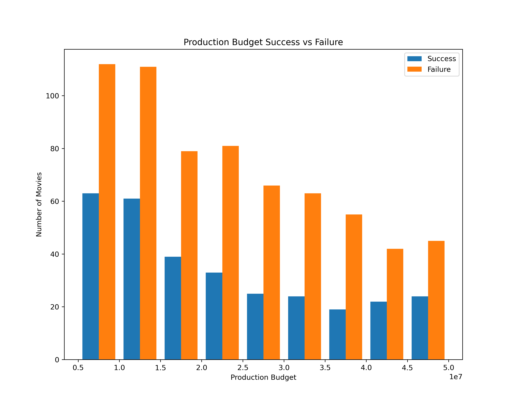

# Movie Database Analysis

Author: [Sean Fry](mailto:seanfry9@gmail.com)

## Overview

This project analyzes multiple movie databases to determine success rates for different characteristics of movies. For this analysis a movie is considered a success if it makes twice as much profit as what the production budget was. In this analysis the three main categories that will be looked at are movie release month, movie genre, and movie production budget. This data can be used by a movie studio to optimize the production of any movies they are making to maximize the chances of success.

## Business Problem

Microsoft should be able to better allocate resources when producing movies to maximize their chances of releasing successful movies based on this analysis. Doing so should reduce wasted resources on unsuccessful movies as well as increase the perception of the studio as more movies are released that are successful.

## Data

Imdb and The Movie Database have a large amount of data on movies released worldwide. The main data we are worried about are titles, money made, production budget, release date data, and movie genre.

## Methods

This project uses descriptive analysis looking at trends based upon different variables. This provides useful information on the chararistics of movies and their success rates. 

## Results

Most movies are released around the December holiday season, but the majority of successful month are in the summer.

Drama, comedy, and Action are the most popular genres, while animation, adventure and mystery have the highest percent of successful movies.

Movies with either a high or low production budget have a higher percentage of successful movies.

## Conclusions

From my data I have decided on three recommendations for Microsoft on how to go about releasing their movies.
* **Release Month**: The highest number of movies are released in October and December, the highest percent success is in July, November and June. Summer movies seem to be more successful and have less competition from other releases.
* **Genre**: Drama is a very crowded and competitve genre, while animation has a higher rate of success and a smaller pool of competition. Comedy, Action, and Adventure movies are also worth looking into.
* **Production Budget**: Looking at the graph of production budget makes me think either extreme of the cost spectrum is more beneficial. Either high or low budget movies produce higher success rates.

## Next Steps

If I had more time to work with this data, here are some other ideas I would like to explore that could improve production efforts at microsoft.
* **Further breakdown of budget**: Getting actual percentages for the production budget as well as the histogram could be valuable
* **Looking at directors**: Looking at which directors have the higheest success rates would be valuable in knowing who to hire for the movies.
* **Looking at lead actors**: We could have looked at the success rate based on actors and numbers of movies the actors have been in.

## For More Information

See the full analysis in the [Jupyter Notebook](./movie_analysis.ipynb) or review this [presentation](./movie_analysis_presentation.pdf).

For additional information, contatct Sean Fry at [seanfry9@gmail.com](mailto:seanfry9@gmail.com).